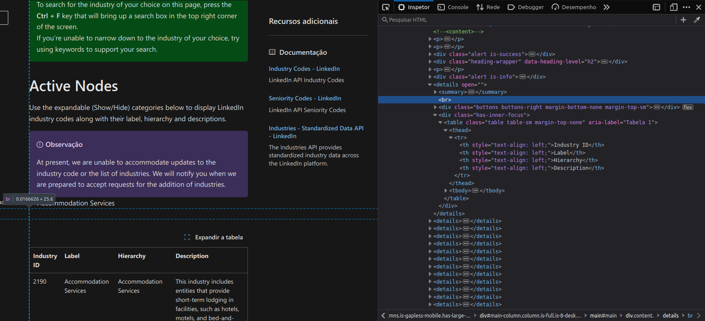

# linkedin-industry-codes-v2
The LinkedIn Industry Codes V2 Extractor &amp; Translator is a tool designed to streamline the process of extracting, translating, and parsing LinkedIn Industry Codes. This project aims to assist developers, data analysts, and businesses in handling LinkedIn's industry categorization data efficiently and accurately.

This repository emerges with the need of embedding this industry codes translated inside the [Mindsight](https://mindsight.com.br) ATS project, and there wasn't any project that had already translated those codes.

## LinkedIn Industry Codes V2

The format of the industry codes is very simple:

| id | label   | hierarchy                 | description      |
|----|---------|---------------------------|------------------|
| 1  | Example | Level 1     >    Example  | Some description |

There are multiple categories in the [LinkedIn Industry Codes V2 page](https://learn.microsoft.com/pt-br/linkedin/shared/references/reference-tables/industry-codes-v2), that contains a table each.

## Processes

### The Extraction

To extract the tables to outside of LinkedIn, a simple script that transforms to a CSV file and downloads it was used. It was used in each table, following a specific **CSS Selector**.

The script used was this: https://stackoverflow.com/a/65639685/8370521
The file name generated was changed to `linkedin_industry_code_v2.csv`. Then, we opened the LinkedIn Industry Codes V2 page and opened the developer console to paste this script as a function so we can use later.

After that, we needed the **CSS Selector** to get the tables, fortunatly, all of them have the same selector: `'details:nth-child(X) > div:nth-child(3) > table:nth-child(1)'`, where `11 >= X >= 30`.

In order to get this process of querying the table correctly working, a `<br>` element must be eliminated in the first table (Accomodation Services), as indicated in this image:



Just open the category and inspect the page with the browser of your choice.

Once done, you can now use this function call after you inserted the CSV downloader function (respecting the **X** variable values):

```js
downloadAsCSV(document.querySelector('details:nth-child(X) > div:nth-child(3) > table:nth-child(1)'))
```

You will have generated 20 files of LinkedIn Industry Codes V2 tables.

Finally, the creation of a general `linkedin_industry_code_v2_all_eng.csv` file is possible, concatenating all of the 20 files into one.
It's worth noticing that this file **does not contain a header line**.

### The Translation

The translation process was possible thanks to [Selenium](https://www.selenium.dev/).

A Python script was created with the [Poetry](https://python-poetry.org/) package manager using an automated process that envolves the CSV generated in English and the Google Translator that roughly translate label, hierarchy and description and saves to the target language CSV.

It takes about 2 hours to make this processes because it needs to allow the webpage to communicate with the server and give it some time to process the translation.

However, after completing the process and having a brand new CSV in the language that you targeted, you **must check** the translations it made. As it **may not translate everything** and sometimes take out of context. (You can skip the description if you like and come back to it later)

Once checked, the parsing process can begin.

### The Parsing

With the new translated CSV on hands, we can parse it to JSON in order to use anywhere (you can use the CSV, but why would you?).

The tool used to generate the JSON was https://csvjson.com/csv2json.
Adding the header to the file, we can now parse to JSON.

And then you can use and modify the generated JSON as you prefer.

As the JSON can become large in size (~160Kb), it's recommended to minify it to use in your system. https://codebeautify.org/jsonminifier was used for this.

## TODOs

- [ ] Script that transforms the tables into CSV files
- [ ] Script that concatenate all CSV files
- [x] Script that roughly translates the completed CSV file
- [ ] Script that transforms the generated CSV into a JSON file
- [ ] Script that minifies the JSON file
- [ ] Improve scripts to allow generally processing the files and translations
